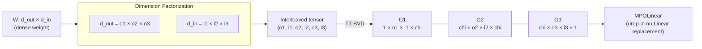
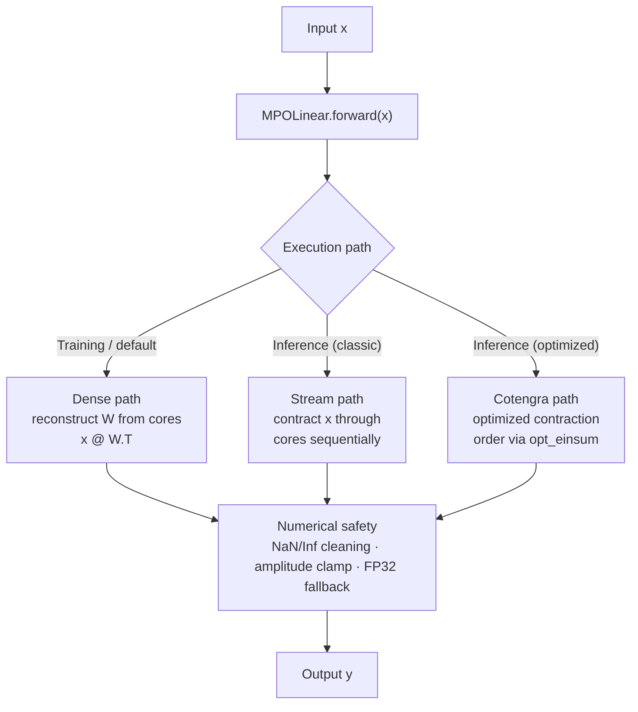
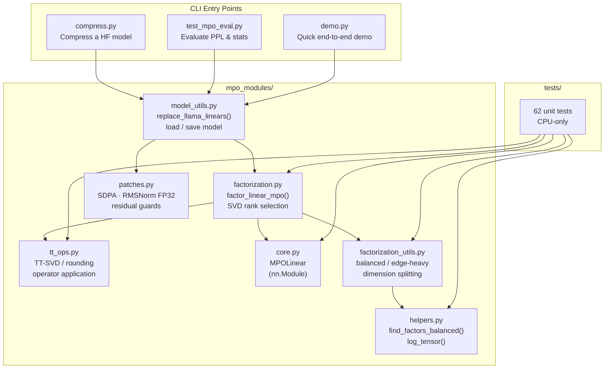

# MPO Compression

[](https://github.com/zhc1212/MPO_Compression/actions/workflows/ci.yml)
[](https://opensource.org/licenses/MIT)
[](https://www.python.org/downloads/)

Extreme compression of Large Language Models using quantum-inspired **Matrix Product Operator (MPO)** tensor network decomposition. Reproduces and extends the method from:

> **CompactifAI: Extreme Compression of Large Language Models using Quantum-Inspired Tensor Networks** ([arXiv:2401.14109](https://arxiv.org/abs/2401.14109))

## How It Works

MPO compression replaces each `nn.Linear` layer in a transformer with a factored representation — a chain of small tensor cores connected by bond dimensions. This dramatically reduces parameter count while preserving the layer's input-output behavior.

### Single Layer Decomposition

A dense weight matrix W is reshaped, permuted, then decomposed into a chain of small 4D cores via sequential SVD. Bond dimension `chi` controls the compression-quality tradeoff.



### Compression Pipeline


### Inference Forward Paths

MPOLinear supports multiple execution paths depending on available libraries and mode:



## Installation

```bash
git clone https://github.com/zhc1212/MPO_Compression.git
cd MPO_Compression
pip install -e .
```

For development (includes ruff, pytest, pre-commit):

```bash
pip install -e ".[dev]"
pre-commit install
```

**Requirements**: Python 3.10+, PyTorch 2.0+, Transformers 4.35+, a GPU with enough VRAM to load your target model.

## Usage

### Step 1: Compress a Model

The `compress.py` script loads a HuggingFace model, replaces all `nn.Linear` layers with MPO cores, and saves the result.

```bash
CUDA_VISIBLE_DEVICES=0 python compress.py \
    --model_name meta-llama/Llama-2-7b-chat-hf \
    --out_dir ./outputs/llama-7b-mpo \
    --num_cores 3 \
    --mid_chi 100 \
    --deep_chi 40 \
    --freeze_blocks 5 \
    --mid_blocks 20
```

**What each argument does:**

| Argument | Default | Description |
|----------|---------|-------------|
| `--model_name` | `meta-llama/Llama-2-7b-chat-hf` | HuggingFace model ID or local path |
| `--out_dir` | `./llama-7b-mpo-compressed_new` | Where to save the compressed model |
| `--num_cores` | `3` | Number of MPO cores per layer (2 or 3; more cores = finer factorization) |
| `--mid_chi` | `100` | Bond dimension for shallower layers (higher = better quality, less compression) |
| `--deep_chi` | `40` | Bond dimension for deeper layers (can be more aggressive) |
| `--freeze_blocks` | `5` | Skip compression for the first N transformer blocks (preserve early layers) |
| `--mid_blocks` | `20` | Number of blocks (after frozen ones) that use `mid_chi`; the rest use `deep_chi` |
| `--skip_mlp` | `down_proj` | Skip compression for this MLP projection type |

**Output**: The compressed model is saved as HuggingFace-compatible safetensors + an `mpo_config.json` that records per-layer compression settings.

**Typical compression**: With the default settings, LLaMA-2-7B goes from ~6.7B to ~2.5-3B parameters (~40-60% compression).

### Step 2: Evaluate the Compressed Model

Measure perplexity (PPL) on WikiText-2 to check quality:

```bash
CUDA_VISIBLE_DEVICES=0 python test_mpo_eval.py \
    --model_dir ./outputs/llama-7b-mpo \
    --datasets wikitext2 \
    --seq_len 2048 \
    --batch_size 4 \
    --fp32 \
    --print_layer_stats \
    --seed 42 \
    --deterministic
```

**Key evaluation arguments:**

| Argument | Description |
|----------|-------------|
| `--model_dir` | Path to compressed model directory (must contain `mpo_config.json`) |
| `--datasets` | Evaluation datasets: `wikitext2`, `ptb`, or both |
| `--seq_len` | Sequence length for PPL evaluation (default: 2048) |
| `--batch_size` | Batch size (reduce if OOM) |
| `--fp32` | Force FP32 inference (more stable, slower) |
| `--bf16` / `--fp16` | Use half precision (faster, may be less stable) |
| `--print_layer_stats` | Print per-layer parameter counts and compression ratios |
| `--retie` | Retie lm_head with embed_tokens (for models with shared embeddings) |
| `--safe_eval` | Use sliding-window evaluation with overlap |
| `--deterministic` | Enable CUDA deterministic mode for reproducibility |

**Example output:**

```
=== Layer Stats (MPOLinear) ===
  - model.layers.5.self_attn.q_proj: MPO=1.64M / Dense=16.78M | retain=9.77% compress=90.23%
  - model.layers.5.self_attn.k_proj: MPO=1.64M / Dense=16.78M | retain=9.77% compress=90.23%
  ...
Total: MPO=120.50M / Dense=500.00M | retain=24.10% compress=75.90%

PPL (wikitext2): 12.34
```

### Step 3 (Optional): Use as a Python Library

You can also use the MPO compression API directly in your code:

```python
import torch
import torch.nn as nn
from mpo_modules import factor_linear_mpo, get_mpo_compression_ratio, MPOLinear

# --- Compress a single layer ---
linear = nn.Linear(4096, 4096, bias=False)
mpo = factor_linear_mpo(linear, bond_dim=64, num_cores=3)

# Forward pass works identically
x = torch.randn(8, 4096)
y = mpo(x)  # shape: [8, 4096]

# Check compression stats
ratio = get_mpo_compression_ratio(4096, 4096, num_cores=3, bond_dim=64)
print(f"Parameter ratio: {ratio:.2%}")  # e.g., "Parameter ratio: 18.75%"
```

```python
# --- Load a previously compressed model ---
from mpo_modules import load_mpo_model

model, tokenizer = load_mpo_model("./outputs/llama-7b-mpo")
# model is ready for inference or fine-tuning
```

```python
# --- Estimate bond dimension for a target compression ---
from mpo_modules import estimate_mpo_bond_dim

bond_dim = estimate_mpo_bond_dim(
    in_features=4096,
    out_features=4096,
    num_cores=3,
    target_ratio=0.3,  # keep 30% of parameters
)
print(f"Recommended bond_dim: {bond_dim}")
```

## Tuning Guide

### Choosing Bond Dimension (`chi`)

Bond dimension is the most important hyperparameter. Rules of thumb:

| Target Quality | `mid_chi` | `deep_chi` | Approx. Retention |
|----------------|-----------|------------|-------------------|
| High quality   | 150-200   | 80-100     | ~50-60%          |
| Balanced       | 80-120    | 40-60      | ~30-40%          |
| Aggressive     | 40-60     | 20-30      | ~15-25%          |

### Choosing Which Layers to Compress

- **`freeze_blocks`**: Early transformer blocks (0-4) are crucial for quality. Freezing them (not compressing) significantly helps PPL.
- **`mid_blocks`**: Shallow-to-mid blocks benefit from higher `chi`. Deep blocks can tolerate more aggressive compression.
- **`skip_mlp`**: `down_proj` in MLP is often sensitive to compression. Skipping it helps.

### Edge-Heavy Factorization

For MLP layers, the default balanced factorization limits `chi_max` to 256. Enable edge-heavy mode to push it to 1024:

```bash
MPO_MLP_EDGE_HEAVY=1 python compress.py --mid_chi 500 ...
```

This rearranges the dimension factorization to allow larger bond dimensions at the cost of less balanced core sizes.

## Environment Variables

### Forward Path Control

| Variable | Default | Description |
|----------|---------|-------------|
| `MPO_EVAL_PATH` | `auto` | Evaluation forward path: `auto` (stream), `dense`, `stream` |
| `MPO_TRAIN_PATH` | `auto` | Training forward path: `auto` (stream), `dense`, `stream` |
| `MPO_CLASSIC_BACKEND` | `cotengra` | Stream backend: `cotengra`, `classic`, `cuquantum` |
| `MPO_CONTRACT_DEVICE` | `gpu` | Device for dense weight reconstruction: `gpu`, `cpu` |

### Compression Tuning

| Variable | Default | Description |
|----------|---------|-------------|
| `MPO_MLP_EDGE_HEAVY` | `0` | Enable edge-heavy factorization for MLP layers |
| `MPO_ATTN_EDGE_HEAVY` | `0` | Enable edge-heavy factorization for attention layers |
| `MPO_BALANCED_SVD_SPLIT` | `0` | Use balanced (sqrt-sigma) SVD split for better conditioning |

### Numerical Stability

| Variable | Default | Description |
|----------|---------|-------------|
| `MPO_STREAM_ACCUM32` | `1` | Accumulate in FP32 during streaming contraction |
| `MPO_STREAM_SAFE_CLAMP` | `1000` | Clamp intermediate values to prevent overflow |
| `MPO_CHECKPOINT` | `0` | Enable activation checkpointing (saves VRAM) |
| `MPO_FULLTT_INTERMEDIATE_FP16` | `0` | Use FP16 for intermediate contraction (faster, less stable) |

### Diagnostics

| Variable | Default | Description |
|----------|---------|-------------|
| `MPO_DEBUG` | `0` | Print detailed forward path selection info |
| `MPO_LOG_RECON_ERROR` | `0` | Log per-layer reconstruction error during compression |
| `MPO_REPORT_WX_ERROR` | `0` | Report output-space error `\|\|WX - W'X\|\|` |
| `MPO_WX_SAMPLES` | `256` | Number of random samples for WX error estimation |

## Project Structure



```
MPO_Compression/
├── compress.py                # CLI: compress a HuggingFace model
├── test_mpo_eval.py           # CLI: evaluate compressed model (PPL, stats)
├── demo.py                    # Quick end-to-end demo
├── mpo_modules/               # Core library
│   ├── core.py                # MPOLinear — drop-in nn.Linear replacement
│   ├── tt_ops.py              # TT-SVD decomposition, rounding, operator application
│   ├── factorization.py       # MPO factorization algorithms
│   ├── factorization_utils.py # Dimension splitting strategies (balanced, edge-heavy)
│   ├── helpers.py             # Factor balancing, tensor health logging
│   ├── model_utils.py         # Model loading, layer replacement, saving
│   └── patches.py             # Numerical stability patches (attention, RMSNorm, etc.)
├── tests/                     # Unit tests (CPU-only, no model downloads)
├── pyproject.toml             # Package config, ruff/pytest settings
├── Makefile                   # Dev commands: lint, format, test
└── .github/workflows/ci.yml   # CI: lint + test on Python 3.10/3.11
```

## Development

```bash
make install-dev   # Install dev dependencies + pre-commit hooks
make lint          # Run ruff linter
make format        # Auto-format code
make test          # Run unit tests (CPU only)
make test-cov      # Run tests with coverage report
```

See [CONTRIBUTING.md](CONTRIBUTING.md) for more details.

## Citation

```bibtex
@article{zanardi2024compactifai,
    title={CompactifAI: Extreme Compression of Large Language Models using Quantum-Inspired Tensor Networks},
    author={Zanardi, Andrei and others},
    journal={arXiv preprint arXiv:2401.14109},
    year={2024}
}
```

## License

MIT License — see [LICENSE](LICENSE) for details.
